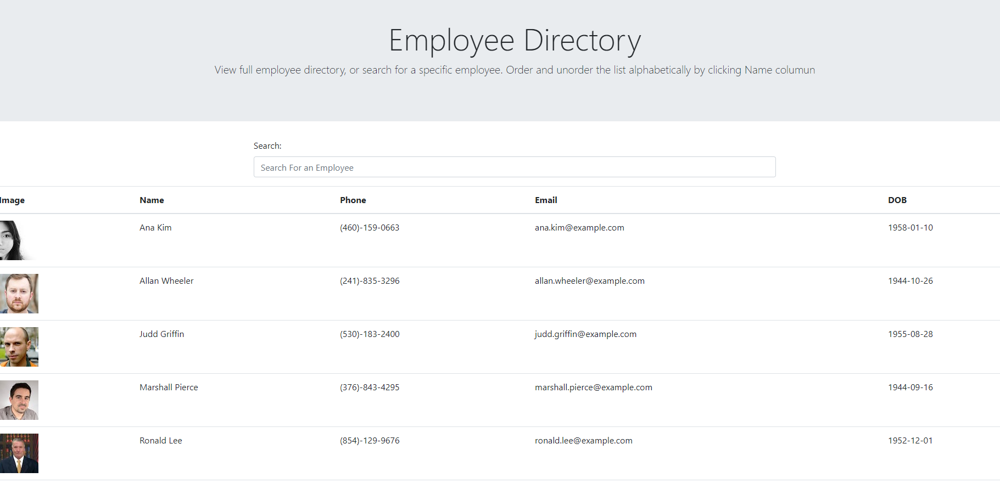

# employee-app
# Employee-Directory
## Description
  ---
  This project is a react app that allows the user to view an employee directory. In the directory the user can repopulate the directory by searching for specific people based on their name. There is an additional option to sort entire employee directory in alphabetical order
  ## Table of Contents 
  --- 
  [Application](#application)

  [Usage](#usage)

  [Contributing](#contributing)

  [Questions](#questions)

  [Link](#deployedLink)

  ## Application
  ---
  
  ## Usage
  ---
  * Load the application an view the entire emplolyee directory but scrolling through the table
  * To search for specific employees by name type in their name in the search bar
  * This will populate the table to with any employees that contains whatever the user types in the search bar
  * To view the previous list simply clear your search bar
  * If the user would like toggle the employee directory to be displayed in alphabetical order click the Name button in the name column.

  ## Contributing
  ---
  * Lorena Ramirez
  ## Questions
  ---
  To reach me with additional questions please contact me with one of the following below.
  * My github profile - [Github Link](https://github.com/Lorena-Ramirez)
  * Email - <ramirezlorenaa18@gmail.com>

 ## Link
  ---
  [Deployed Site](https://lorena-ramirez.github.io/employee-app/)
